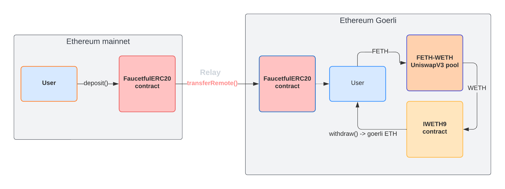

# Faucetful

Recently, there's been a [shortage](https://ethereum-magicians.org/t/testnet-workgroup-paths-out-of-the-goerli-supply-mess/11453) of Goerli ETH. All the faucets are dry or give out max 0.2ETH/day. This has made the life of developers, testers, and ETH hobbyists very difficult. Your only option is to request goerli ETH from random Discord servers or on Twitter.
Faucetful is a solution to this problem. It's a simple way swap your mainnet ETH for Goerli ETH at market rate in one click.

We use the Hyperlane interoperability protocol to wrap your ETH into FETH, bridge it to Goerli, swap for WETH using the Uniswap v3 pool deployed, and unwrap it to deposit Goerli ETH into your address.

Live at [faucetful.vercel.app](https://faucetful.vercel.app/)

## Architecture

- [`FaucetfulERC20.sol`](contracts/FaucetfulERC20.sol): Minimalist ERC20 token for handling deposits/withdrawals on mainnet and georli, and cross-chain transfers.
- [`FaucetfulFactory.sol`](contracts/FaucetfulFactory.sol): Factory contract for easily deploying the FETH-WETH Uniswap v3 pool, swapping tokens, and LPing into the pool.



## Setup

```sh
# Install dependencies
yarn

# Build source and generate types
yarn build
```

## Test

```sh
# Run all unit tests
yarn test

# Lint check code
yarn lint
```

## Learn more

For more information, see the [Hyperlane documentation](https://docs.hyperlane.xyz/hyperlane-docs/developers/getting-started).
